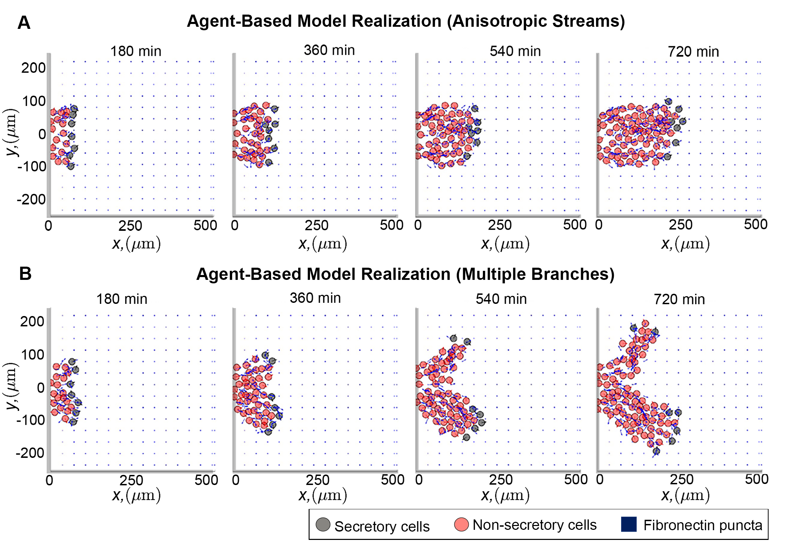
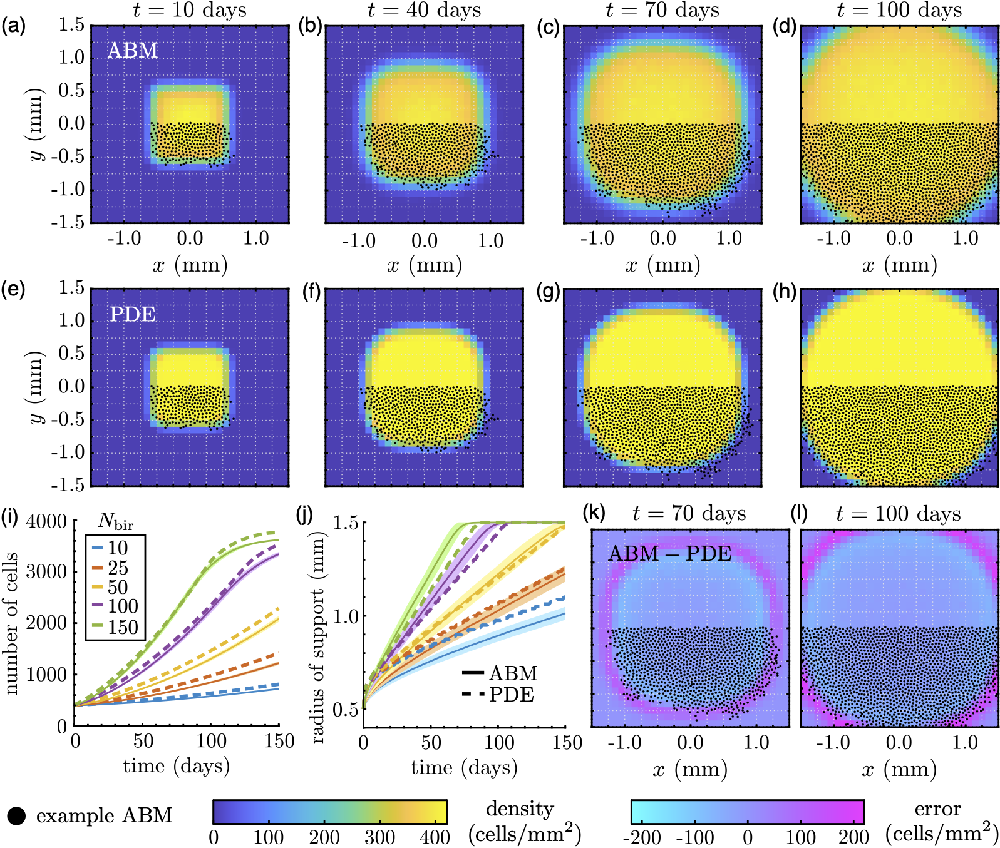

I am a Postdoctoral Research Fellow at the [Francis Crick Institute](https://www.crick.ac.uk/), where I apply spatial statistics and mathematical modelling to quantify the organisation of tumor and immune cells in cancerous environments and use that information to predict their interactions and dynamics over time. Prior to this role I was postdoctoral research fellow at the [Isaac Newton Institute](https://www.newton.ac.uk/) (July 2023 - May 2024), where I investigated mathematical models describing the collective movement of cell and animal groups, and a Postdoctoral Research Associate at the University of Oxford (Principal Investigator: [Prof. José Carrillo](https://www.maths.ox.ac.uk/people/jose.carrillodelaplata)) (January 2022 - July 2023), where I applied techniques from Bayesian inference to uncover new biological insights from experimental data and investigated how aggregation-diffusion equations could be used to model collective cell migration. I completed my doctorate studies in Mathematics at the University of Oxford, where I was supervised by [Prof. Philip Maini](https://people.maths.ox.ac.uk/maini/) and [Prof. Helen Byrne](https://www.maths.ox.ac.uk/people/helen.byrne). My thesis projects studied mathematical modelling of collective cell movement in biological contexts where two types of cells---leaders and followers, respectively---could be distinguished. Before arriving in the United Kingdom, I attended Brown University for my undergraduate studies.
<!-- and grew up in Evanston, IL, USA (a suburb of Chicago). -->

Research interests
==================
I use mathematical modelling to investigate how complicated behaviours of groups arise from seemingly simpler interactions among individuals. This phenomenon, known as collective behaviour, is an important phenomenon to understand since it constitutes an essential feature of life. It is observed in many diverse biological processes, from the coordinated swarming of birds and insects to the formation of organs by cells in developing embryos. Disrupting the individual-level interactions that cause such behaviour to emerge leads to severe consequences, however. These can include developmental disorders that arise from genetic mutations which block cell coordination, for example, or the extinction of a species that cannot communicate anymore due to habitat destruction. Understanding how individual actions influence group behaviour will inspire new strategies to mitigate the consequences of these disruptions and will provide insight into a fundamental aspect of biology.

Connecting individual and collective behaviour remains challenging, however, despite new experimental data that can track the location of multiple organisms at extremely high (up to millisecond-level) resolution. This is because existing analytical tools fail to account for the individual-level diversity and randomness exhibited by living systems. Current machine learning approaches can classify different types of behaviour based on data (e.g., by grouping observations into “flocking” or “hunting” categories) but cannot uncover their underlying causes. Mathematical models developed from physical principles, by contrast, are more difficult to link to data but can explore how interactions lead to certain population-level behaviours.

My research aims to unify these mathematical and statistical approaches by creating novel approaches that construct simple theoretical models of collective behaviour from detailed tracking data. These tools employ innovative techniques known as topological data analysis and Bayesian inference to accurately predict how individual-level diversity impacts group decision-making. I apply these tools with collaborators across the world to understand their limits, uncover new biolgical insights, and provide testable predictions that can guide experimental design.

My applications span a diverse set of phenomena across biology and ecology, including how zebrafish stripes form and how lion prides reach new water sources. My past research projects have tended to follow two broad themes:

## 1) Understanding the reciprocal interactions between collective movement and individual surroundings

I am interested in understanding how collective movement alters, and is itself affected by, the surroundings in which individuals travel. My previous research highlights a potentially important role for the "environment" that individuals occupy: for instance, one [investigation](https://elifesciences.org/articles/83792) from my doctorate studies suggests that the microenvironment through which certain stem cells move controls the robustness and success of their long-distance migration. Additional results from that study also highlighted the potential for the microenvironment to &quot;encode&quot; prior cell movements. Along with several biological collaborators, I am developing simple mathematical models to produce experimentally testable predictions on how the geometry through which cells move influences the stability of their moving populations. I am also using these mathematical models to determine whether it is possible to design computational tools to infer prior cell behaviours based on observations of their microenvironment.

<!-- Mathematical modelling and analysis of collective cell movement within environments that are heterogeneous in space and change in time.  -->

The above photo shows a cropped image from [(Martinson et al., <i>eLife</i> 2023)](https://elifesciences.org/articles/83792) depicting two simulations of an individual-based mathematical model that describes the movement of stem cells. The blue points/arrows represent the proteins that make up the surroundings. Over the course of the simulation leading cells (black circles) remodel their surroundings to create a &quot;scaffold&quot; along which trailing cells (red circles) crawl along, creating ribbon-like streams such as those observed <i>in vivo</i>.

## 2) Linking mathematical models to individual-based data

I am interested in creating novel methods that connect mathematical models to individual-level data, such as those typically collected from biological experiments. Even in an idealised setting, where the data come from another mathematical model with known parameters, this problem can be difficult to address. One [investigation](https://journals.aps.org/pre/abstract/10.1103/PhysRevE.102.062417) early in my doctorate studies, for instance, found that an established model for cell movement needed to be altered to sufficiently match synthetic data, even though the data themselves were generated using identical rules for how cells move and divide. However, that paper also showed that it was possible to correct for such errors, and [other studies](https://link.springer.com/article/10.1007/s00285-021-01570-w) demonstrated how this corrected model could be thought of as the &quot;simplest&quot; mathematical model that could accurately describe the biological system, since it gave identical solutions as more complicated models for biologically relevant conditions.

Working with several mathematical collaborators, I have been [developing](https://royalsocietypublishing.org/doi/full/10.1098/rsos.232002) a computational pipeline for fitting mathematical models of cell movement and proliferation to image-based data. This procedure relies on statistical methods (e.g., maximum likelihood estimation or Approximate Bayesian Computation) to construct mathematical descriptions of moving cell populations that accurately describe the patterns they adopt over time. With these tools, investigators will be able to create more efficient and analytically tractable models that are more likely to describe experimental results.

The above photo shows a figure from [(Martinson et al., <i>Roy. Soc. Open Sci.</i> 2024)](https://royalsocietypublishing.org/doi/full/10.1098/rsos.232002), in which a methodology for linking population-level mathematical models to individual-based data, such as those seen from experiments, is developed. The figure demonstrates a proof-of-concept applied to synthetic data, which are generated using a simple individual- or agent-based model (ABM). Specifically, we construct an &quot;average&quot; individual-based result based on multiple replicates of ABM experiments, then fit parameters of a continuous mathematical model that describes the same underlying processes as the ABM (here, cell movement and birth) by minimising the sum of squared differences between the two sets of results. The figure shows how this process can create a continuous model that accurately captures both the spatial spread of the data as well as the number of cells over time.
