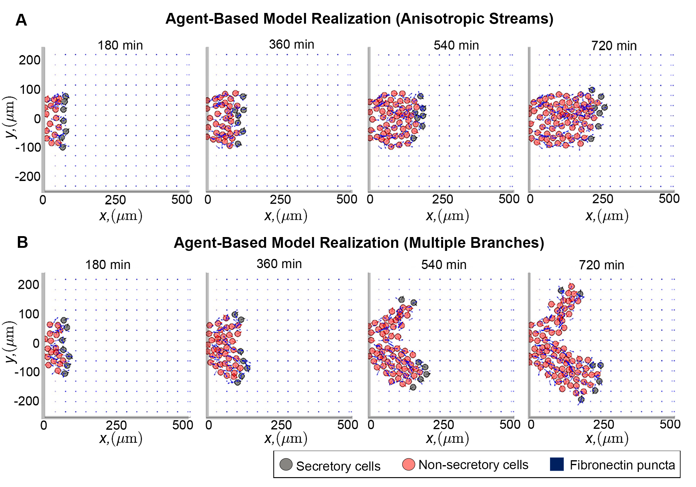
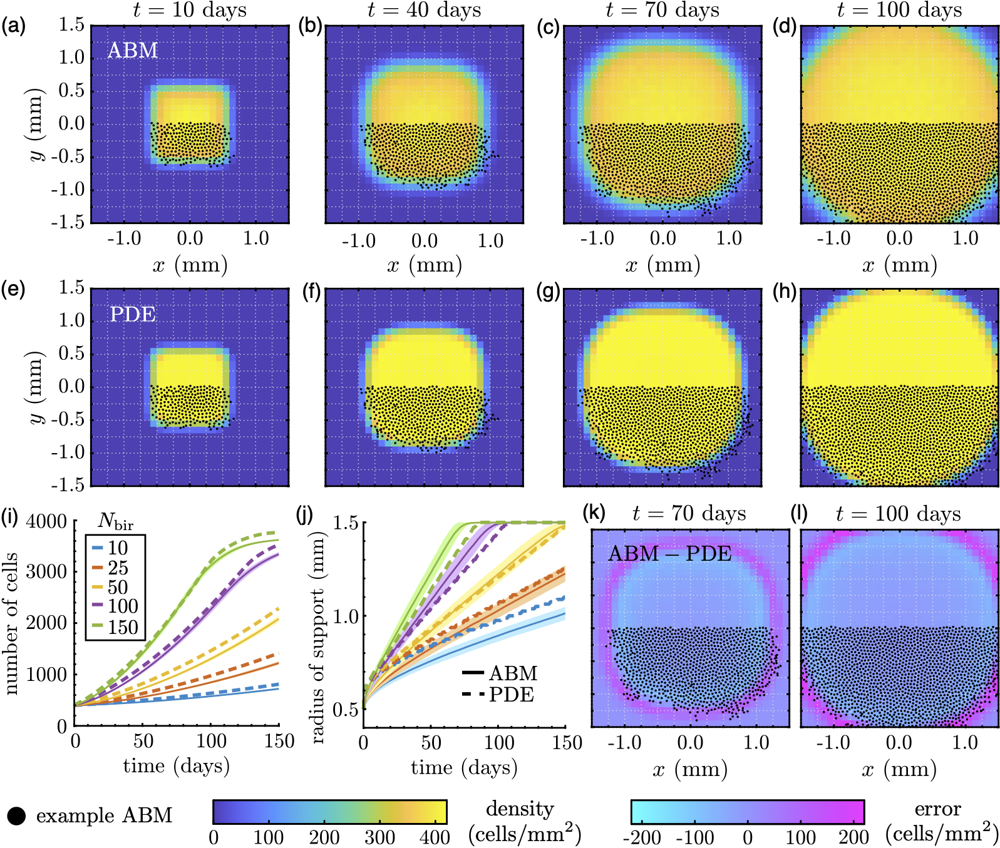

About Me
==================
I am a Postdoctoral Research Fellow in the Tumour Cell Biology Lab (Principl Investigator: [Dr. Erik Sahai](https://www.crick.ac.uk/research/labs/erik-sahai)) of the Francis Crick Institute. My current research focuses on uncovering mechanisms that govern the evolution of tumor microenvironments through the creation and calibration of data-driven mathematical models. Prior to this role, I was a Postdoctoral Research Fellow at the [Isaac Newton Institute](https://www.newton.ac.uk/) (July 2023 - May 2024) and a Postdoctoral Research Associate at the University of Oxford (Principal Investigator: [Prof. José Carrillo](https://www.maths.ox.ac.uk/people/jose.carrillodelaplata); January 2022 - July 2023), where I studied theoretical frameworks that described the collective movement of cells and animals. I completed my doctorate in Mathematics at the University of Oxford, where I was supervised by [Prof. Philip Maini](https://people.maths.ox.ac.uk/maini/) and [Prof. Helen Byrne](https://www.maths.ox.ac.uk/people/helen.byrne). My thesis projects studied mathematical modelling of collective cell movement in biological contexts where two types of cells---leaders and followers, respectively---could be distinguished. Before arriving in the United Kingdom, I completed my undergraduate degree (Sc. B.) in Applied Mathematics-Biology at Brown University.
<!-- and grew up in Evanston, IL, USA (a suburb of Chicago). -->

Research Interests
==================
How do individuals’ surroundings shape their behaviour? This question has enormous importance in cancer, since the cells and proteins around tumor cells can act like a &quot;soil&quot; for the cancer &quot;plant,&quot; helping to promote its growth and invasion or limit its detection by the immune system. New clinical treatments aim to eliminate cancers by making their neighborhoods less hospitable, but they have had mixed success because the relationship between cancer state and neighbourhood is a two-way street: each influences the other. To further uncover the nature of this relationship, we need new tools that not only distinguish different tumor neighborhoods but also explain how they arise from the interactions between cells.

My research tackles this problem by using mathematical modelling to identify &quot;signatures&quot; of tumor soils and track them over time. Specifically, I measure neighbourhood composition close to and far from the cancer &quot;root&quot; by counting cell types within circles of increasing radii around each cancer cell in biopsy images. These quantities are just snapshots of neighborhoods, but by fitting computer simulations of cell movement, birth, and death to these data, I fill in gaps between pictures and identify the most likely set of interactions that led to them. In doing so, I uncover how &quot;tumor-hostile&quot; neighborhoods arise and narrow down targets that drive them to this state. In other words, my work reveals how one can “poison” the tumor plant through its soil.

<!-- I use mathematical modelling to investigate how complicated behaviours of groups arise from seemingly simpler interactions among individuals. This phenomenon, known as collective behaviour, is an important phenomenon to understand since it constitutes an essential feature of life. It is observed in many diverse biological processes, from the coordinated swarming of birds and insects to the formation of organs by cells in developing embryos. Disrupting the individual-level interactions that cause such behaviour to emerge leads to severe consequences, however. These can include developmental disorders that arise from genetic mutations which block cell coordination, for example, or the extinction of a species that cannot communicate anymore due to habitat destruction. Understanding how individual actions influence group behaviour will inspire new strategies to mitigate the consequences of these disruptions and will provide insight into a fundamental aspect of biology.

Connecting individual and collective behaviour remains challenging, however, despite new experimental data that can track the location of multiple organisms at extremely high (up to millisecond-level) resolution. This is because existing analytical tools fail to account for the individual-level diversity and randomness exhibited by living systems. Current machine learning approaches can classify different types of behaviour based on data (e.g., by grouping observations into “flocking” or “hunting” categories) but cannot uncover their underlying causes. Mathematical models developed from physical principles, by contrast, are more difficult to link to data but can explore how interactions lead to certain population-level behaviours.

My research aims to unify these mathematical and statistical approaches by creating novel approaches that construct simple theoretical models of collective behaviour from detailed tracking data. These tools employ innovative techniques known as topological data analysis and Bayesian inference to accurately predict how individual-level diversity impacts group decision-making. I apply these tools with collaborators across the world to understand their limits, uncover new biolgical insights, and provide testable predictions that can guide experimental design.

My applications span a diverse set of phenomena across biology and ecology, including how zebrafish stripes form and how lion prides reach new water sources. My past research projects have tended to follow two broad themes: -->

Specifically, I have been interested in two broad themes: 

## 1) Understanding the reciprocal interactions between collective movement and individual surroundings

I am interested in understanding how collective movement alters, and is itself affected by, the surroundings in which individuals travel. My previous research highlights a potentially important role for the &quot;environment&quot; that individuals occupy: for instance, one [investigation](https://elifesciences.org/articles/83792) from my doctorate studies suggests that the microenvironment through which certain stem cells move controls the robustness and success of their long-distance migration. This study also highlighted the potential for the microenvironment to &quot;encode&quot; prior cell movements. Along with several biological collaborators, I am developing simple mathematical models to produce experimentally testable predictions on how the geometry through which cells move influences the stability of their moving populations, and whether it is possible to design computational tools to infer prior cell behaviours based on observations of their microenvironment.

<!-- Mathematical modelling and analysis of collective cell movement within environments that are heterogeneous in space and change in time.  -->

The above photo shows a cropped image from [(Martinson et al., <i>eLife</i> 2023)](https://elifesciences.org/articles/83792) depicting two simulations of an individual-based mathematical model that describes the movement of stem cells. The blue points/arrows represent proteins which support the cells as they move. Over the course of the simulation leading cells (black circles) remodel these proteins to create a &quot;scaffold&quot; along which trailing cells (red circles) crawl, resulting in cells moving in ribbon-like streams such as those observed <i>in vivo</i>.

## 2) Linking mathematical models to individual-based data

<!-- In the future, you should rewrite this section to include the new papers from Ian and zebrafish stuff. -->

I am interested in developing and applying novel methods that connect mathematical models to data collected in biological experiments. Even in an ideal setting, where data have a known &quot;ground truth&quot;, this problem can be difficult to [address](https://journals.aps.org/pre/abstract/10.1103/PhysRevE.102.062417). Working with several mathematical collaborators, I have been [developing](https://royalsocietypublishing.org/doi/full/10.1098/rsos.232002) a computational pipeline for fitting mathematical models of cell movement and division to imaging data. This procedure relies on statistical methods (e.g., maximum likelihood estimation or Approximate Bayesian Computation) to calibrate mathematical descriptions of moving cell populations to patterns over time. With these tools, investigators will be able to create more efficient and analytically tractable models that are more likely to describe experimental results.

The above photo shows a figure from [(Martinson et al., <i>Roy. Soc. Open Sci.</i> 2024)](https://royalsocietypublishing.org/doi/full/10.1098/rsos.232002), which develops a method to link population-level mathematical models to individual-based data. The figure demonstrates this procedure on a test case with synthetic data, which are generated using a simple agent-based model (ABM). Specifically, we construct an &quot;average&quot; individual-based result based on multiple replicates of ABM experiments, then fit parameters of a population-level model that describes the same underlying processes as the ABM (here, cell movement and birth) by minimising the sum of squared differences between the two sets of results. The figure shows how this process can create a continuous model that accurately captures both the spatial spread of the data as well as the number of cells over time.
